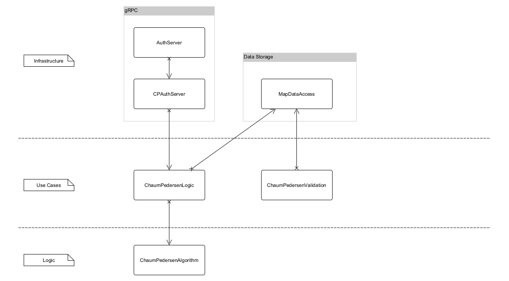

# Task

Design and write the code that implements the ZKP Chaum–Pedersen Protocol outlined in ["Cryptography: An Introduction (3rd Edition) Nigel Smart"](https://www.cs.umd.edu/~waa/414-F11/IntroToCrypto.pdf) page 377 section "3. Sigma Protocols" subsection "3.2. Chaum–Pedersen Protocol.". Solution should be implemented as server and client using gRPC protocol according to the provided interface described in the './proto/auth.proto' file. The code should implement very simple server and client applications.

# Architecture

This app follows roughly the [Clean Architecture](https://blog.cleancoder.com/uncle-bob/2012/08/13/the-clean-architecture.html). This architecture is supposed to protect the most important aspects of the application - the business logic.



Here I separated the actual algorithm as much as possible from the rest of the app. On the outside are the gRPC and data storage. Below that comes the use case layer, which acts a mediator.

Here I have a design smell, because the use case layer is accessing the data storage in the intrastructure layer. Usually a gateway is defined in the use case layer which is imlemented in the infrastructure layer. Even better would be that the use case layer only manipulates the domain objects and the data access layer automatically detects these manipulations and stores them.

The logic layer only contains the algortihm. I added this layer because the algorithm is the most sacred part of the code. It should be protected from changes as much as possible. The logic layer is also the only layer that is not allowed to access any other layer.

# Approach

- Understand and test Chaum–Pedersen protocol
- Implement useable protcol service
- Understand gRPC implementation in Rust
- Implement basic gRPC client
- Implement basic gRPC server with simple data access layer

At this point I did it hackathon style. Meaning choosing the fastest way to the desired result. From this point on I concentrated on the aspects relevant for develoing production ready code.

- Use traits to abstract structs in preparation for testing
- Write integration tests for core use case. This allows me to do refactorings without breaking it.
- Write more tests that cover edge cases
- Add separation layer between IO/network components and the core logic (the alogrithm)

At this point my time for implementation was running out, so I stopped at this point to concentrate on getting the applications to a real environment (docker + aws)

- Documentation for the library root module - this is the least amount of necessary documentation
- Added docker container for the server and client
- Added command line interface for the client

# Improvments

- Testing
  - Unit tests for the core algorithm
  - Integration tests as gherkin tests with [cucumber-rs](https://cucumber-rs.github.io/cucumber/current/)
- Design
  - Use an event driven architecture to decouple the different parts of the application
- Code quality / Robustness
  - Still too many unwrap() inside the code, which needs to be handled graciously
  - Use a logging framework to log errors and other information
- Performance
  - Reduce/Remove RwLocks as much as possible - this will be a huge bottleneck
  - Use a database to handle growing data amount and for perstistence

# How to run
The application is dockerized and can be run with docker-compose. The docker-compose file is located in the root directory.

```bash
docker-compose up
```

Once the server is running, the client container can be accessed with the following command:

```bash
docker exec -it <folder-name>-client-1 bash
```

Alternatively the application can be run with cargo. This requires the [rust toolchain]((https://www.rust-lang.org/tools/install)) to be installed:

## Run the server
```bash
cargo run --bin auth-server
```

## Run the client
The client requires the server to be running. It is a CLI application that can be run with the following command:

```bash
cargo run --bin auth-client help
```

This command will print the interface of the client application.